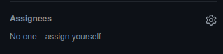
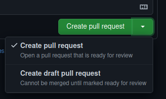

# Development

## Editors

### WebStorm

In this repo you have available a `.idea` folder with settings you might want
to use. It comes with some default configuration.

#### Recommended Plugins
* [Vite  Integrated](https://plugins.jetbrains.com/plugin/16897-vite-integrated)
* [IntelliVue](https://plugins.jetbrains.com/plugin/index?xmlId=tv.twelvetone.intellij.plugins.intellivue&utm_source=product&utm_medium=link&utm_campaign=WS&utm_content=2021.3)
* [Prettier](https://prettier.io/)
* [TSLint](https://palantir.github.io/tslint/)
* [Vue.js](https://www.jetbrains.com/help/webstorm/vue-js.html)

#### Common Commands
* **[Git Rebase](https://git-scm.com/docs/git-rebase):**
We use git rebase to keep a good commits history and avoid problems with conflicts.
```shell
$ git pull <remote> <branch> --rebase

$ git rebase <branch-to-rebase>
```

* **Serve Application:** Used to run the Vue app.
```shell
$ yarn serve
```

* **Lint Staged:** This script is used by our **[GitHub actions](GITHUB_ACTIONS.md)** to run a lot of checks. 
You can use it too to ensure that your code will pass on the actions.
```shell
$ yarn lint-staged
```

* **Setup Application:** Used to set up the application installing the deps and adding some extra configurations.
```shell
$ yarn setup
```

* **Run Tests:** Used to run the (by now) the unit tests.
```shell
$ yarn test
```

* **Run Storybook:** Used to run the **[storybook](STORYBOOK.md)**.
```shell
$ yarn storybook
```

## Git

### Recommendations

* Rebase instead of merge
* Make your commit messages meaningful
* Commits should contain the reference Issue whenever is possible. Case there is no referring issue, try to use a concise commit message.
* The first line of the commit message needs to be concise. If there is more stuff to tell, use a new line. It will help other developers to understand the commit history.
* Avoid creating larger commits, try to split into smaller ones. Have one commit per logical change and one major feature per pull request
* Fix typos by amending or rebasing

### Example of a commit message

#### Good

> fix(Location): ensure Location will populate necessary fields
-------
> feat: Support new "description" field on all widgets


#### Bad

> Fixed a typo.
-------
> Trying that thing again
-------
> Issue #123

### Creating a pull request

Bellow you will find the steps to create and deal with your pull requests.

#### Before create a pull request
* Run the tests locally and ensure that all of them are passing
* Run the storybook locally and ensure that is working
* Run the `lint-staged` script and ensure that there's no issues
* Do a rebase with the `develop` branch and ensure that there's no conflicts

#### Creating a pull request
* Give it good title

##### BAD


##### GOOD


* Give it a good description keeping in mind that everyone in the project should be able to read and understand what 
you did
* Assign yourself in the `assignees` section. You can click in the `assign yourself` button or click in the button with
an engine icon and select yourself and the other people that are working with you on the pr.



* Now you can create the PR by clicking in the `Create draf pull request` button.



#### AFTER
* Once you created your pr, you should keep it always updated with your local code (doing `git pull's`) and the `develop`
branch
* Once you finished your task, you should follow this steps:
  * check the PR title and description and ask to yourself: "this title and description reflects what I did here?". 
  Then, update (or not) them
  * Do a self-review in your code ensuring that you've not let `console.logs`, typos or code that is not following
  the good practices behind
  * Ensure that your PR has no conflicts with the `develop` branch
  * Ensure that the [GitHub Actions](GITHUB_ACTIONS.md) are passing
  * Now you can click in the `Ready for review` button and ask for your teammates reviews
* Once you asked for your teammates reviews, you should fix what they asked for
* Keep your branch always updated with develop to ensure that we'll have no conflicts
* Once you have two or more approvals on your PR, it can be merged
* After merge your pr (the last reviewer will do it to you), you should warn your teammates about it if the code you've
merged can break something else or your it's a very important code that can impact all the team

```markdown
# Please, **NEVER** let a pull request open for more than one day. When you have an open PR, it should be your focus.
```